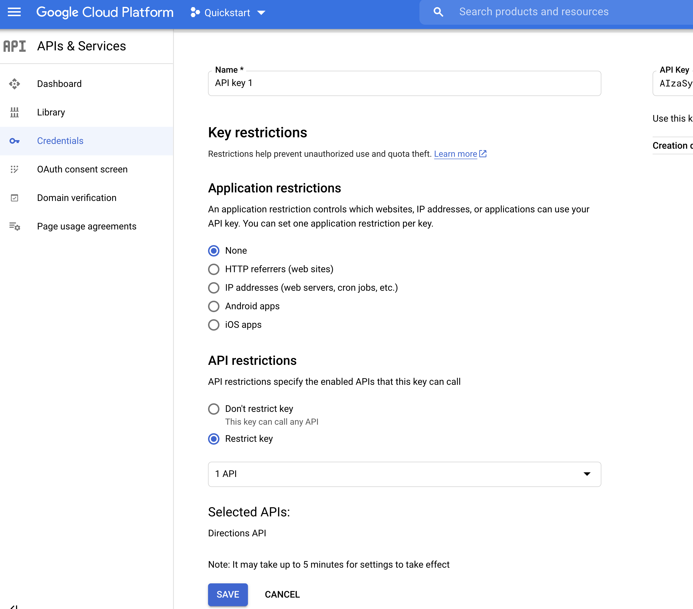
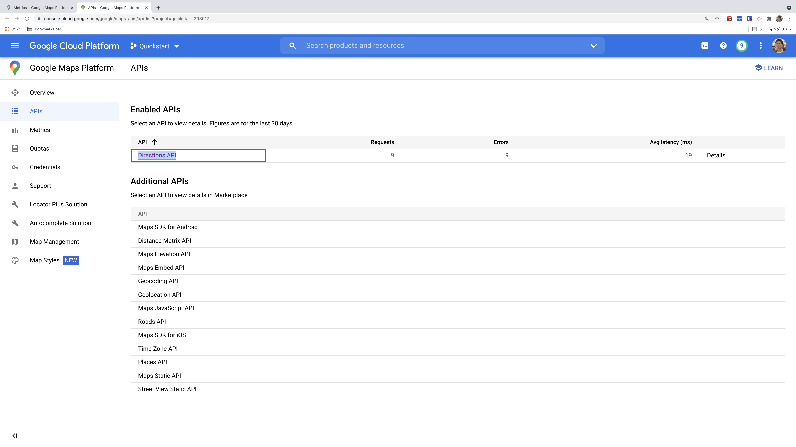
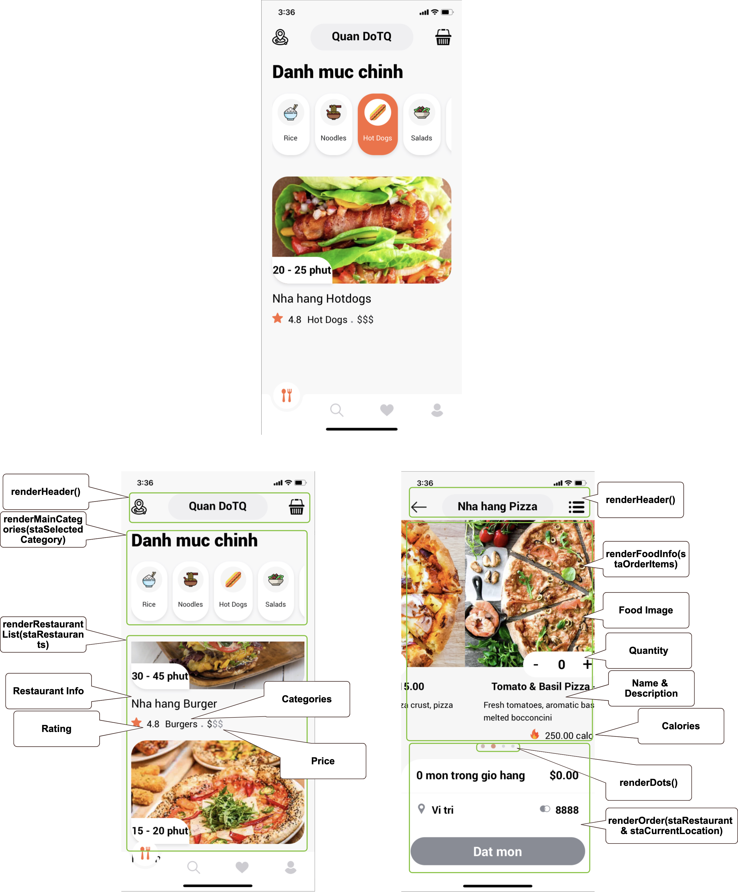

# rn-fe-samples-demo-food-delivery 🐳


[](https://github.com/tquangdo/rn-fe-samples-demo-food-delivery/issues/new)

## Usage
scan bar code on `expo go` appstore

## GG map
### add GG map API key
1. access `https://console.cloud.google.com/apis/credentials` > create `API Keys`
2. edit key restriction

3. copy paste API key into `constants/maps.js`
4. enable billing of GG project (`Quickstart`): `https://console.cloud.google.com/projectselector2/billing/enable`
5. enable `Directions API`

6. access `https://console.cloud.google.com/google/maps-apis/metrics?project=quickstart-293017` to check result, output log...
### src code
screens/OrderDelivery.js
```js
import MapView, { PROVIDER_GOOGLE, Marker } from 'react-native-maps';
import MapViewDirections from "react-native-maps-directions";
...
    // "Marker" khac voi "MapView", chi la 1 dau cham
    // Marker>toLocation
    <Marker
        coordinate={(toLocation) ? toLocation : {
            latitude: 10.784680,
            longitude: 106.695970
        }}
    >...</Marker>
...
return (
    <View style={{ flex: 1 }}>
        {/* "MapView" hien all GG map fullscreen */}
        <MapView
            ref={mapView}
            provider={PROVIDER_GOOGLE}
            // "region" la vi tri cua "screens/Home.js>initialCurrentLocation"
            initialRegion={region}
            style={{ flex: 1 }}
        >
            {/* "MapViewDirections" ve route tu "fromLocation"->"toLocation" */}
            <MapViewDirections
                origin={fromLocation}
                destination={toLocation}
                apikey={GOOGLE_API_KEY}
                ...
                onReady={...}
            />
            {destinationMarker()}
            {fromLocation ? carIcon() : null}
        </MapView>
    </View>) 
```

## demos app

